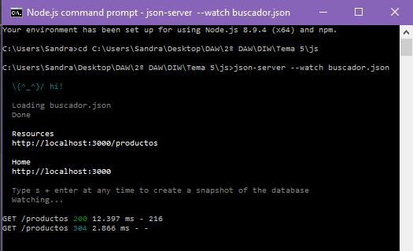
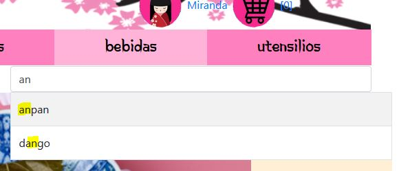

# Utilización de mecanismos de comunicación asíncrona (Ajax y XML)
### Busqueda de productos ene l buscador
Lo primero que hacemos es descargarnos un servidor ligero, después creamos el JSON con la lista de productos:

```
{
  "productos": [
    { "nombre": "taiyaki", "precio": "3€" },
      { "nombre": "anpan", "precio": "3€" },
      { "nombre": "mochi", "precio": "3€" },
      { "nombre": "dango", "precio": "3€" }
  ]
}
```
a continuación cremos el script que nos permita sacar la información de los productos de nuestro json

primero tenemos que arrancar nuestro servidor para poder obtener los datos del json, para ello lo iniciamos y metemos el comando ```json-server --watch buscador.json ```



despues creamos un evento keydown, despues obtenemos el json de nuestro servidor.
Lo primero que hara nuestra funcion es obtener el json del servidor, despues obtendrá las letras introducidas en el buscador y buscará similitudes entre esas letras y el array de productos del json, cuando encuentre que un producto contiene esas letras lo mostrará, de lo contrario no mostrara nada.
por ejemplo: si el usuario mete las letras 'an', se buscará en el array de prductos todos los productos que contengan la palabra 'an' y los mostrara:



```
 $("#search").keydown(function(){
    $.getJSON("http://localhost:3000/productos", function(data){
        var search = $("#search").val();
        var regEx = new RegExp(search, 'i');
        var output;
        $.each(data, function(key, val){
               if((val.nombre.search(regEx) !=-1)){
                   output+="<tr>"
                   output+="<td id='"+key+"'>"+val.nombre+"</td>"
                   output+="<td id='"+key+"'>"+val.precio+"</td>"
                   output+="</tr>"
                   if(document.getElementById("search").value===""){
                        $("table").hide();
                    }else{
                        $("table").show();
                    }
               }
            });
        $("tbody").html(output);
    });
})
 
```

### Generar opciones del campo paises con json
Primero obtenemos el json y lo guardamos en la variable paisesURL, despues hacemos la peticion y si el status es 200 y ready state es 4, es que todo va bien y entonces podemos llamar a la funcion getJSON que irá sacando los paises del array del json uno a uno y creando cada uno de ellos en el formulario mediante DOM.
```
function muestraCampo(){
   
    var cajaPaises= document.getElementById("pais"),option;
            var paisesUrl ="https://raw.githubusercontent.com/umpirsky/country-list/master/data/es/country.json";

        var getJSON = function(url) {
          return new Promise(function(resolve, reject) {
            var xhr = new XMLHttpRequest();
            xhr.open('get', url, true);
            xhr.responseType = 'json';
            xhr.onload = function() {
              var status = xhr.status;
              var readyState = xhr.readyState;   
              if (status == 200 && readyState==4) {
                resolve(xhr.response);
              } else {
                reject(status);
              }
            };
            xhr.send();
          });
        };

        getJSON(paisesUrl).then(function(data) {
         for(var i in data)   {
             option= document.createElement("option");
             option.setAttribute("value", i);
             option.innerHTML=i;
             cajaPaises.appendChild(option);
            
         }
          
        }, function(status) {
          alert('Error...');
        }); 

}
```
